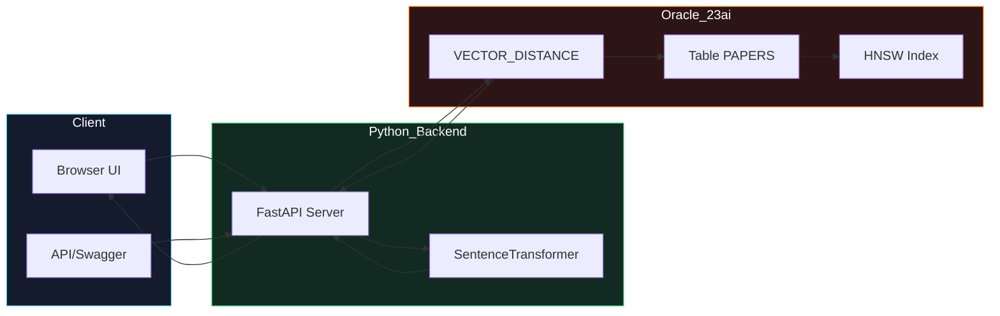
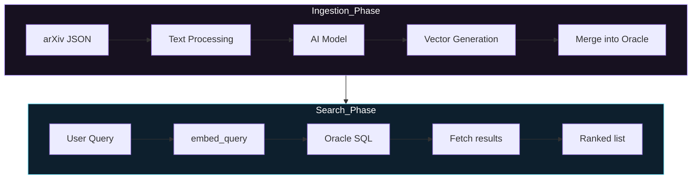
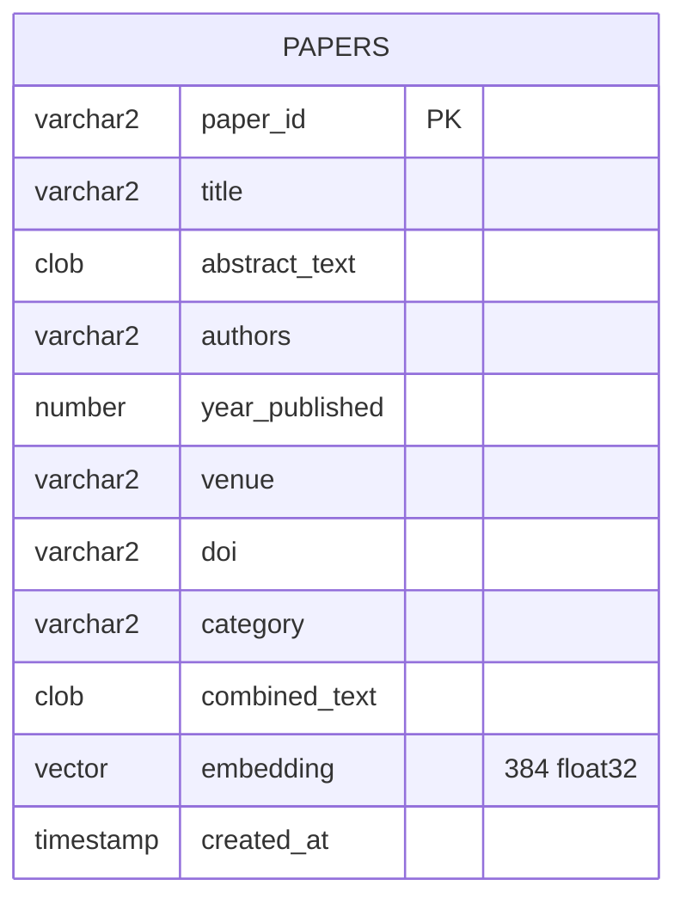
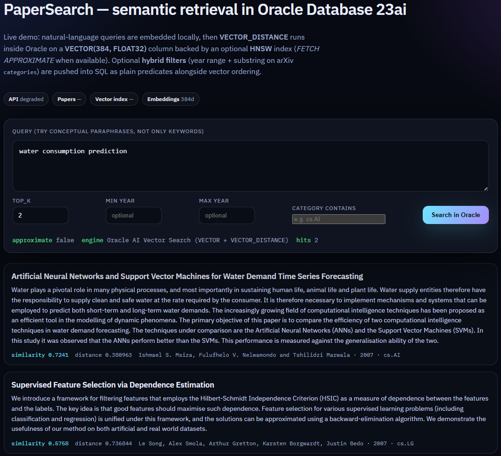
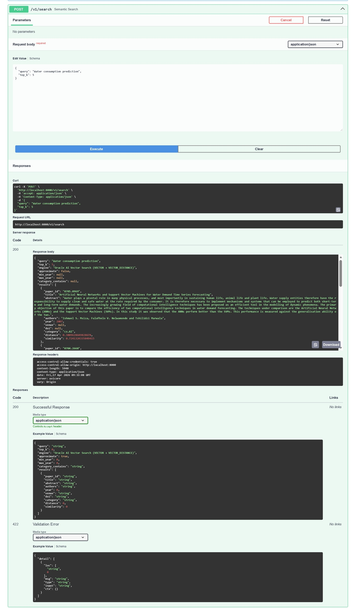
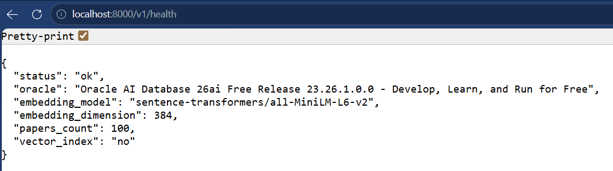

# PaperSearch — semantic academic search on **Oracle AI Vector Search**

This project is a functional semantic search engine tailored for academic papers. 
- **Input:** A natural language query or concept expressed by the user (e.g., *"neural networks applied to genomic sequences"*).
- **Processing:** The system translates the text query into a mathematical vector using a locally running AI transformer model. It then compares this query vector against thousands of pre-processed document vectors stored natively in the database.
- **Output:** A ranked list of the most contextually relevant academic research papers, matching the *meaning* of the input rather than just exact keywords.

From a technical perspective, this is a complete reference implementation: we embed titles and abstracts with a compact model, store the resulting **384-dimensional `VECTOR(FLOAT32)`** embeddings in **Oracle Database 23ai**, and retrieve matching records using the SQL **`VECTOR_DISTANCE`** function — optionally accelerated by an **HNSW** vector index and **`FETCH APPROXIMATE`**.

The goal of this project is to provide a robust implementation that demonstrates a clear architecture, efficient data retrieval, and readable database interactions.

---

## What we are demonstrating

Traditional keyword search (BM25 / inverted indexes) excels at lexical overlap, but users often ask with **concepts and paraphrases**. **Dense embeddings** map text into a space where proximity ≈ semantic similarity. **Oracle AI Vector Search** brings that geometry into the database tier: vectors are first-class columns, distance is a SQL function, and **approximate nearest neighbor (ANN)** indexes trade a controlled amount of recall for predictable latency at scale.

This repo keeps embeddings **outside** the database (Python + `sentence-transformers`) to reduce setup friction, while still exercising the parts that matter for an Oracle vector narrative: **`VECTOR` storage**, **`VECTOR_DISTANCE`**, **HNSW index**, and **`FETCH APPROXIMATE FIRST k ROWS ONLY`**.

---

## Architecture



**Design choices and architecture highlights:**

- **Hybrid placement**: embeddings computed in Python (portable, easy to swap models) but **similarity is evaluated in Oracle** — you can point to a realistic enterprise pattern (ETL / microservice generates vectors; DB enforces access, freshness, and hybrid predicates).
- **Schema**: `combined_text` mirrors what the model sees; `embedding` is the persisted oracle vector; metadata columns keep the UI rich for evaluation.
- **ANN path**: when `PAPERS_EMBEDDING_HNSW_IDX` exists and `PAPERSEARCH_USE_APPROXIMATE_FETCH=true`, search uses **`FETCH APPROXIMATE`** — a good talking point about recall/latency trade-offs.

---

## Technical pipeline



---

## Logical data model



---

## Tooling & versions (test matrix)

| Component | Notes |
|-----------|------|
| **Python** | 3.11+ recommended (CI-style sanity on 3.12 works) |
| **Oracle** | **Oracle Database 23ai Free** — default **`gvenzl/oracle-free:23-slim`** (Docker Hub, no Oracle account). Optional: official registry image — see below. |
| **Corpus** | Bundled `data/papers.json` (sample) **or** Kaggle [Cornell-University/arxiv](https://www.kaggle.com/datasets/Cornell-University/arxiv) → default export **`data/papers.kaggle.json`** (does not overwrite the sample file) |
| **CLI** | `papersearch search "…"` (tabulated hits) |
| **Driver** | `python-oracledb` thin mode (no Instant Client required) |
| **Embeddings** | `sentence-transformers/all-MiniLM-L6-v2` → **384d** |
| **API** | FastAPI + Uvicorn |
| **Containers** | Docker / Docker Compose |

> The embedding model downloads weights on first run (~90–120 MB class of artifacts depending on cache). Plan network access once before the first run.

---

## Hardware / VM guidance

| Profile | RAM | Disk | Why |
|---------|-----|------|-----|
| **Comfortable** | ≥ **8 GiB** system RAM | ~15 GB free | Oracle Free container + model cache + headroom |
| **Tight** | 6 GiB | ≥12 GB free | May work with smaller concurrent apps closed |
| **Cloud VM** | `Standard_D4s_v5` class (4 vCPU / 16 GiB) | Premium SSD | Smooth Docker experience for running the environment |

If the database refuses to build the **HNSW** graph due to memory budget, see **Troubleshooting → ORA-51962** (run `set-vector-memory` once per PDB).

---

## Quick start (full demo stack)

### Default: no Oracle website account required

This repo’s **`docker-compose.yml`** uses **`gvenzl/oracle-free:23-slim`** from **Docker Hub** ([project](https://github.com/gvenzl/oci-oracle-free)). It is a **well-maintained community packaging** of **Oracle Database 23ai Free** with the same SQL features this project needs (`VECTOR`, `VECTOR_DISTANCE`, vector indexes). You **do not** need **`docker login container-registry.oracle.com`**.

**There is no separate Oracle license fee** for Oracle Database Free for dev / test / learn; always respect Oracle’s own terms for the underlying product.

**1. Start Oracle**

```bash
cp .env.example .env
docker compose pull oracle   # optional; pulls from Docker Hub
docker compose up -d oracle
python3 -m pip install -e ".[dev]"
python3 scripts/wait_for_oracle.py
python3 -m papersearch.cli set-vector-memory
python3 -m papersearch.cli init
python3 -m papersearch.cli seed --path data/papers.json --replace
python3 -m papersearch.cli serve
```

### Official Oracle Container Registry (optional)

If you **prefer** the image from **`container-registry.oracle.com/database/free`**, you normally need a **free Oracle (SSO) account**, **accept the license** in the registry UI, and **`docker login container-registry.oracle.com`** — database images there are **not** anonymous pulls. Swap the `image:` / `environment:` keys in `docker-compose.yml` to match Oracle’s documented Free container (e.g. `ORACLE_PWD`, setup scripts); the Python app and SQL in this repo stay the same.

**Optional — real arXiv slice (Kaggle metadata, ~cs.AI / cs.LG / cs.CL)**

`import-kaggle` writes **`data/papers.kaggle.json` by default** so you do not overwrite the committed **`data/papers.json`** sample corpus. If the output file already exists, add **`--overwrite`** (check runs *before* any download). Load into Oracle with **`seed --path`** or **`make seed-kaggle`**.

```bash
# ~/.kaggle/kaggle.json or env KAGGLE_USERNAME + KAGGLE_KEY
python3 -m papersearch.cli import-kaggle --max-papers 1200
python3 -m papersearch.cli seed --path data/papers.kaggle.json --replace
# or: make seed-kaggle
# Re-import same path: import-kaggle ... --overwrite
```

**CLI search (no browser)**

```bash
python3 -m papersearch.cli search "transformer attention" --top-k 5 --min-year 2017 --category cs.CL
```

Then open **`http://localhost:8000/`** (static UI) and **`http://localhost:8000/docs`** (OpenAPI).

**One-liner for starting the full platform via Makefile**:

```bash
make demo
```

`make demo` assumes Docker can reach **Docker Hub** (default image pulls there on first `up` if needed). It does **not** run `docker login` for you unless you switch to the **official** registry image.

---

## API surface

| Method | Path | Purpose |
|--------|------|---------|
| `GET` | `/v1/health` | Oracle connectivity, corpus size, vector index presence |
| `POST` | `/v1/search` | Semantic search + **hybrid SQL**: `query`, `top_k`, optional `min_year`, `max_year`, `category_contains` |
| `POST` | `/v1/admin/init` | DDL for `papers` table |
| `POST` | `/v1/admin/ingest` | Upsert arbitrary papers (recomputes embeddings) |

> Admin routes are intentionally open for local use and demonstrations; **do not expose them publicly** without authentication.

---

## Execution and obtained results

Running the application exposes both a simple web interface and a comprehensive REST API. The semantic search capabilities allow matching documents even when exact keywords are not used.

**Example queries that highlight semantic matching against the dataset:**
- *"dense passage retrieval beating lexical BM25 for open QA"* pulls information retrieval and machine learning documents.
- *"consensus protocol easier to teach than Paxos for replicated logs"* accurately returns distributed systems and Raft architecture papers.
- *"protein structure prediction reaching experimental accuracy in CASP"* returns hits for AlphaFold and related computational biology papers.

### Screenshots

- **UI Results:** 
- **API Response:** 
- **Container Health:** 

---

## Interpretation of results

To properly evaluate the search system, the following details are essential regarding how the results are computed and displayed:

- **Distance vs. Similarity**: Oracle AI Vector Search, using `VECTOR_DISTANCE` with the `COSINE` metric, returns a **distance** value. A smaller distance implies higher semantic similarity between the query and the documents. In our UI, we convert this to a similarity score defined as `1 / (1 + distance)` strictly for better human readability.
- **Approximate vs. Exact Search**: When an HNSW index is successfully created in the vector memory, the database executes a `FETCH APPROXIMATE`. This sacrifices a marginal amount of recall for a significant performance boost in query execution time, trading off exact precision for predictable low latency at scale. If memory is tight or the index is missing, exact vector search is seamlessly used through `FETCH FIRST K ROWS ONLY`.

---

## Relevant code fragments (where Oracle vector search lives)

Source locations: **DDL + HNSW index** → `src/papersearch/repository.py` (`init_schema`, `ensure_vector_index`), **Similarity SQL** → `search_semantic` in the same module, **Embeddings** → `src/papersearch/embeddings.py`, **HTTP API** → `src/papersearch/api.py`.

### Table creation with the `VECTOR` column

```sql
CREATE TABLE papers (
  paper_id       VARCHAR2(64) PRIMARY KEY,
  title          VARCHAR2(4000) NOT NULL,
  abstract_text  CLOB NOT NULL,
  authors        VARCHAR2(2000),
  year_published NUMBER(4),
  venue          VARCHAR2(500),
  doi            VARCHAR2(256),
  category       VARCHAR2(500),
  combined_text  CLOB NOT NULL,
  embedding      VECTOR(384, FLOAT32) NOT NULL,
  created_at     TIMESTAMP(9) DEFAULT SYSTIMESTAMP NOT NULL
);
```

### Semantic search query — `VECTOR_DISTANCE` with optional `FETCH APPROXIMATE`

```sql
-- Approximate path (when HNSW index exists and is enabled):
SELECT paper_id, title, abstract_text, authors, year_published,
       venue, doi, category,
       VECTOR_DISTANCE(embedding, :qvec, COSINE) AS dist
FROM papers
ORDER BY dist
FETCH APPROXIMATE FIRST :k ROWS ONLY;

-- Exact fallback (no vector index or approximate disabled):
-- ... same SELECT ...
FETCH FIRST :k ROWS ONLY;
```

### HNSW vector index creation (tiered retry on ORA-51962)

```sql
CREATE VECTOR INDEX PAPERS_EMBEDDING_HNSW_IDX
ON papers (embedding)
ORGANIZATION INMEMORY NEIGHBOR GRAPH
DISTANCE COSINE
WITH TARGET ACCURACY 95
PARAMETERS (TYPE HNSW, NEIGHBORS 16, EFCONSTRUCTION 200);
```

If this fails with **ORA-51962** (vector memory pool exhausted), the application automatically retries with progressively lighter parameters (`8/64`, `8/48`, `4/32`) until one succeeds or all tiers are exhausted.

---

## Troubleshooting

### `ORA-51962: The vector memory area is out of space`

Oracle reserves a separate **vector pool** for HNSW / IVF structures. On a fresh **Oracle Free** PDB the limit is often **too low for `CREATE VECTOR INDEX`**. **Seeding still succeeds** — embeddings are stored; only the optional HNSW "shortcut" is missing. That is **not** an application failure: the CLI uses **exact** `VECTOR_DISTANCE` + `FETCH FIRST` when no index exists (fast for thousands of rows).

**Built-in mitigation:** when the first `CREATE VECTOR INDEX` hits **ORA-51962**, this repo **automatically retries** with lighter HNSW settings. Tier retries are logged at **DEBUG**; if all tiers fail you get a single **INFO** line (not `ERROR`) explaining that exact search is in use. To **skip** index creation entirely on known-tight instances: `python3 -m papersearch.cli seed ... --skip-vector-index`. Otherwise use the SYSDBA step below if your PDB allows a larger pool.

**Fix (automated in this repo):** run once as SYS. With the default **`gvenzl/oracle-free`** compose file, the SYS password is **`ORACLE_SYS_PASSWORD`** in `.env` (passed into the container as **`ORACLE_PASSWORD`**). If you switch to the **official** Oracle Free image, use whatever variable that image documents (often **`ORACLE_PWD`**) and set **`ORACLE_SYS_PASSWORD`** to match for the Python helper.

```bash
python3 -m papersearch.cli set-vector-memory --size 512M
python3 -m papersearch.cli reindex-vector
```

Then confirm health shows `vector_index: yes` (`GET /v1/health`).

Equivalent SQL (if you prefer `sqlplus`):

```sql
ALTER SESSION SET CONTAINER = FREEPDB1;
ALTER SYSTEM SET vector_memory_size = 512M SCOPE=BOTH;
```

If `SCOPE=BOTH` is rejected, the CLI falls back to `SCOPE=MEMORY` for the current instance.

### `ORA-51955` / `ORA-02097` when raising `VECTOR_MEMORY_SIZE`

**Oracle Database Free** (notably small-RAM / slim images) can cap the PDB so **no extra vector pool** can be granted (`ORA-51955: … cannot be increased more than 0 MB`). The CLI command `set-vector-memory` detects this and exits with code **3** with a short hint instead of suggesting a wrong password.

Semantic search **still works** using **exact** top‑`k` over `VECTOR_DISTANCE` without an HNSW index: the API already uses **`FETCH FIRST`** (not `FETCH APPROXIMATE`) when no vector index exists.

Optionally set **`PAPERSEARCH_USE_APPROXIMATE_FETCH=false`** in `.env` so configuration matches "no approximate/HNSW" for docs and health reporting.

### Other `ORA-` errors when creating the vector index

If **all** automatic HNSW tiers fail and raising `VECTOR_MEMORY_SIZE` is not possible, drop any stray index on `papers(embedding)` and re-run `reindex-vector`. If the PDB allows more pool, try **`--size 1G`** with `set-vector-memory` (subject to SGA limits — see Oracle *Size the Vector Pool* documentation).

### `DPY-4005: timed out waiting for the connection pool`

The database was not accepting sessions (still booting, wrong port/service, or password mismatch). The CLI now uses a **direct connection** so you should see a clearer **`ORA-xxxxx`** first; if you still see DPY-4005, it is coming from the **API pool** (`papersearch serve`) — fix connectivity, then restart the server.

Always wait for readiness before `init` / `seed`:

```bash
python3 scripts/wait_for_oracle.py
```

### "Health is `degraded`"

Almost always DSN / credentials / container not ready yet. Re-run `python3 scripts/wait_for_oracle.py` and confirm:

```text
PAPERSEARCH_ORACLE_USER=papersearch
PAPERSEARCH_ORACLE_PASSWORD=<matches docker-compose ORACLE_APP_PASSWORD>
PAPERSEARCH_ORACLE_DSN=localhost:1521/FREEPDB1
```

### First search is slow

Cold start downloads the embedding model; subsequent searches reuse the process.

---

## References (bibliography)

1. **Community** Oracle Database Free images (default in this repo’s Compose): `https://github.com/gvenzl/oci-oracle-free`
2. Oracle Container Registry — **Database Free** (optional official pull / license context): `https://container-registry.oracle.com/`
3. Oracle Documentation — **SQL `CREATE VECTOR INDEX`**: `https://docs.oracle.com/en/database/oracle/oracle-database/23/sqlrf/create-vector-index.html`
4. Oracle Documentation — **`VECTOR_DISTANCE`**: `https://docs.oracle.com/en/database/oracle/oracle-database/23/sqlrf/vector_distance.html`
5. Reimers, N. & Gurevych, I. **Sentence-BERT**: Sentence Embeddings using Siamese BERT-Networks (EMNLP 2019). `https://arxiv.org/abs/1908.10084`
6. Robertson, S. & Zaragoza, H. **The Probabilistic Relevance Framework: BM25 and Beyond** (FnTIR, 2009) — useful contrast for "why not only sparse retrieval".

---

## Development

```bash
python3 -m pip install -e ".[dev]"
python3 -m ruff check src tests
python3 -m pytest -q
```

---

## License

MIT — see `LICENSE`.
