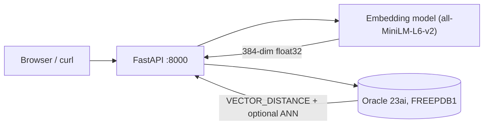
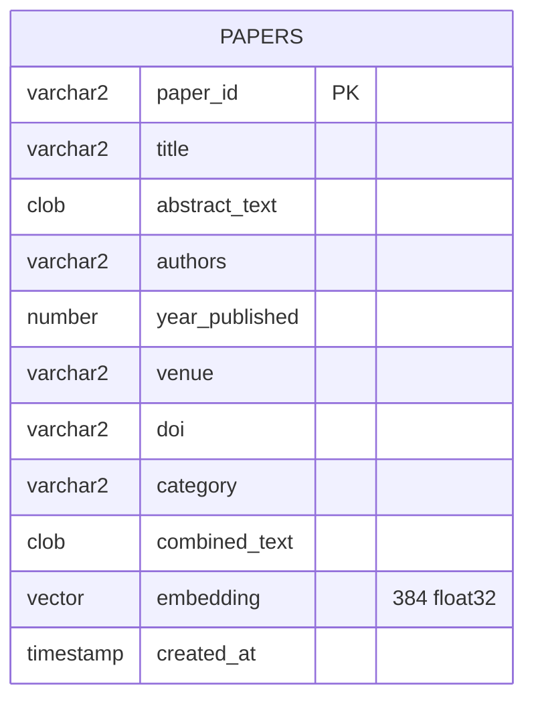

# PaperSearch — semantic academic search on **Oracle AI Vector Search**

Small, presentation-ready reference implementation: embed titles+abstracts with a compact transformer model, store **384-dimensional `VECTOR(FLOAT32)`** embeddings in **Oracle Database 23ai**, and retrieve with **`VECTOR_DISTANCE`** — optionally accelerated by an **HNSW** vector index and **`FETCH APPROXIMATE`**.

The goal is a **15-minute live demo** that feels credible to engineers: clear architecture, measurable latency story, and SQL you can show on a slide.

---

## What you are demonstrating (elevator + one slide)

Traditional keyword search (BM25 / inverted indexes) excels at lexical overlap, but users often ask with **concepts and paraphrases**. **Dense embeddings** map text into a space where proximity ≈ semantic similarity. **Oracle AI Vector Search** brings that geometry into the database tier: vectors are first-class columns, distance is a SQL function, and **approximate nearest neighbor (ANN)** indexes trade a controlled amount of recall for predictable latency at scale.

This repo keeps embeddings **outside** the database (Python + `sentence-transformers`) to reduce demo friction, while still exercising the parts that matter for an Oracle vector narrative: **`VECTOR` storage**, **`VECTOR_DISTANCE`**, **HNSW index**, and **`FETCH APPROXIMATE FIRST k ROWS ONLY`**.

---

## Architecture



Edge labels are **double-quoted** so GitHub’s Mermaid renderer does not interpret `float32[384]`-style brackets inside link text as node syntax.

**Design choices (why this impresses engineers without overfitting the assignment):**

- **Hybrid placement**: embeddings computed in Python (portable, easy to swap models) but **similarity is evaluated in Oracle** — you can point to a realistic enterprise pattern (ETL / microservice generates vectors; DB enforces access, freshness, and hybrid predicates).
- **Schema**: `combined_text` mirrors what the model sees; `embedding` is the persisted oracle vector; metadata columns keep the UI rich for demos.
- **ANN path**: when `PAPERS_EMBEDDING_HNSW_IDX` exists and `PAPERSEARCH_USE_APPROXIMATE_FETCH=true`, search uses **`FETCH APPROXIMATE`** — a good talking point about recall/latency trade-offs.

---

## Logical data model



---

## Tooling & versions (test matrix)

| Component | Notes |
|-----------|------|
| **Python** | 3.11+ recommended (CI-style sanity on 3.12 works) |
| **Oracle** | **Oracle Database 23ai Free** — default **`gvenzl/oracle-free:23-slim`** (Docker Hub, no Oracle account). Optional: official registry image — see below. |
| **Corpus** | Bundled `data/papers.json` (demo) **or** Kaggle [Cornell-University/arxiv](https://www.kaggle.com/datasets/Cornell-University/arxiv) → default export **`data/papers.kaggle.json`** (does not overwrite the demo file) |
| **CLI** | `papersearch search "…"` (tabulated hits) |
| **Driver** | `python-oracledb` thin mode (no Instant Client required) |
| **Embeddings** | `sentence-transformers/all-MiniLM-L6-v2` → **384d** |
| **API** | FastAPI + Uvicorn |
| **Containers** | Docker / Docker Compose |

> The embedding model downloads weights on first run (~90–120 MB class of artifacts depending on cache). Plan network access once before the presentation.

---

## Hardware / VM guidance

| Profile | RAM | Disk | Why |
|---------|-----|------|-----|
| **Comfortable** | ≥ **8 GiB** system RAM | ~15 GB free | Oracle Free container + model cache + headroom |
| **Tight** | 6 GiB | ≥12 GB free | May work with smaller concurrent apps closed |
| **Cloud VM** | `Standard_D4s_v5` class (4 vCPU / 16 GiB) | Premium SSD | Smooth Docker experience for live demos |

If the database refuses to build the **HNSW** graph due to memory budget, see **Troubleshooting → ORA-51962** (run `set-vector-memory` once per PDB).

---

## Quick start (full demo stack)

### Default: no Oracle website account required

This repo’s **`docker-compose.yml`** uses **`gvenzl/oracle-free:23-slim`** from **Docker Hub** ([project](https://github.com/gvenzl/oci-oracle-free)). It is a **well-maintained community packaging** of **Oracle Database 23ai Free** with the same SQL features this project needs (`VECTOR`, `VECTOR_DISTANCE`, vector indexes). You **do not** need **`docker login container-registry.oracle.com`**.

**There is no separate Oracle license fee** for Oracle Database Free for dev / test / learn; always respect Oracle’s own terms for the underlying product.

**1. Start Oracle**

```bash
cp .env.example .env
docker compose pull oracle   # optional; pulls from Docker Hub
docker compose up -d oracle
python3 -m pip install -e ".[dev]"
python3 scripts/wait_for_oracle.py
python3 -m papersearch.cli set-vector-memory
python3 -m papersearch.cli init
python3 -m papersearch.cli seed --path data/papers.json --replace
python3 -m papersearch.cli serve
```

### Official Oracle Container Registry (optional)

If you **prefer** the image from **`container-registry.oracle.com/database/free`**, you normally need a **free Oracle (SSO) account**, **accept the license** in the registry UI, and **`docker login container-registry.oracle.com`** — database images there are **not** anonymous pulls. Swap the `image:` / `environment:` keys in `docker-compose.yml` to match Oracle’s documented Free container (e.g. `ORACLE_PWD`, setup scripts); the Python app and SQL in this repo stay the same.

**Optional — real arXiv slice (Kaggle metadata, ~cs.AI / cs.LG / cs.CL)**

`import-kaggle` writes **`data/papers.kaggle.json` by default** so you do not overwrite the committed **`data/papers.json`** demo corpus. If the output file already exists, add **`--overwrite`** (check runs *before* any download). Load into Oracle with **`seed --path`** or **`make seed-kaggle`**.

```bash
# ~/.kaggle/kaggle.json or env KAGGLE_USERNAME + KAGGLE_KEY
python3 -m papersearch.cli import-kaggle --max-papers 1200
python3 -m papersearch.cli seed --path data/papers.kaggle.json --replace
# or: make seed-kaggle
# Re-import same path: import-kaggle ... --overwrite
```

**CLI search (no browser)**

```bash
python3 -m papersearch.cli search "transformer attention" --top-k 5 --min-year 2017 --category cs.CL
```

Then open **`http://localhost:8000/`** (static UI) and **`http://localhost:8000/docs`** (OpenAPI).

**One-liner for rehearsed demos** (same steps via Makefile):

```bash
make demo
```

`make demo` assumes Docker can reach **Docker Hub** (default image pulls there on first `up` if needed). It does **not** run `docker login` for you unless you switch to the **official** registry image.

---

## API surface (for the live demo)

| Method | Path | Purpose |
|--------|------|---------|
| `GET` | `/v1/health` | Oracle connectivity, corpus size, vector index presence |
| `POST` | `/v1/search` | Semantic search + **hybrid SQL**: `query`, `top_k`, optional `min_year`, `max_year`, `category_contains` |
| `POST` | `/v1/admin/init` | DDL for `papers` table |
| `POST` | `/v1/admin/ingest` | Upsert arbitrary papers (recomputes embeddings) |

> Admin routes are intentionally open for teaching; **do not expose them publicly** without authentication.

---

## Suggested **15-minute** presentation flow (≈ timing)

1. **Problem (60–90s)** — keyword search misses paraphrases; users ask in natural language; citations live in silos.
2. **Idea (60–90s)** — map documents + queries into a shared vector space; rank by geometric proximity; keep retrieval **close to data** for governance + hybrid filters.
3. **Architecture (90s)** — show the mermaid diagram above; call out Oracle responsibilities vs Python responsibilities.
4. **Live demo (10–12m)** — follow a tight script:
   - `GET /v1/health` → narrate **banner**, **papers_count**, **vector_index** (`yes` if HNSW built; `no` still allows exact vector top‑`k`).
   - Open `/` UI → run **3 qualitatively different** queries (below).
   - Open `/docs` → execute the same `POST /v1/search` and show JSON distances.
   - Toggle story: if an HNSW index exists, compare **approximate** vs **exact** paths; on Oracle Free without an index, narrate **exact** top‑`k` only (optional: `DROP INDEX PAPERS_EMBEDDING_HNSW_IDX` when present).

**Demo queries that land on different clusters in `data/papers.json`:**

- *“dense passage retrieval beating lexical BM25 for open QA”* → expects DPR-style hits.
- *“consensus protocol easier to teach than Paxos for replicated logs”* → Raft / systems.
- *“protein structure prediction reaching experimental accuracy in CASP”* → AlphaFold / biology.

5. **Interpretation (60s)** — explain **`distance` vs `similarity`**: Oracle returns a **distance**; the UI shows `1/(1+distance)` only for readability.
6. **Close (30–45s)** — stretch: ONNX embeddings **inside** Oracle (`VECTOR_EMBEDDING`), RAG citations, evaluation harness. **Hybrid filters** (year + category) are already in SQL for the demo story.

---

## Evidence pack (assignment checklist)

This repository is designed so you can attach **objective artifacts** even if a reviewer cannot run Docker:

| Artifact | Where |
|----------|------|
| **Working source** | `src/papersearch/` |
| **Runnable instructions** | This README + `Makefile` |
| **Screenshots (you capture during rehearsal)** | Create `docs/screenshots/` and add PNGs — e.g. `docker compose ps`, `/v1/health` JSON, UI results for two queries, `/docs` try-it-out panel |
| **Logs** | Terminal output from `seed` (ingest + optional HNSW attempt) and `serve` |
| **Interpretation notes** | “15-minute flow” + “Troubleshooting” sections here |

---

## Relevant code fragments (where Oracle vector search lives)

- **DDL + HNSW index**: `src/papersearch/repository.py` (`init_schema`, `ensure_vector_index` — retries lighter HNSW on ORA-51962)
- **Similarity SQL**: `search_semantic` in the same module (`VECTOR_DISTANCE` + `FETCH APPROXIMATE` branch)
- **Embeddings**: `src/papersearch/embeddings.py`
- **HTTP API**: `src/papersearch/api.py`

---

## Troubleshooting

### `ORA-51962: The vector memory area is out of space`

Oracle reserves a separate **vector pool** for HNSW / IVF structures. On a fresh **Oracle Free** PDB the limit is often **too low for `CREATE VECTOR INDEX`**. **Seeding still succeeds** — embeddings are stored; only the optional HNSW “shortcut” is missing. That is **not** an application failure: the CLI uses **exact** `VECTOR_DISTANCE` + `FETCH FIRST` when no index exists (fast for thousands of rows).

**Built-in mitigation:** when the first `CREATE VECTOR INDEX` hits **ORA-51962**, this repo **automatically retries** with lighter HNSW settings. Tier retries are logged at **DEBUG**; if all tiers fail you get a single **INFO** line (not `ERROR`) explaining that exact search is in use. To **skip** index creation entirely on known-tight instances: `python3 -m papersearch.cli seed ... --skip-vector-index`. Otherwise use the SYSDBA step below if your PDB allows a larger pool.

**Fix (automated in this repo):** run once as SYS. With the default **`gvenzl/oracle-free`** compose file, the SYS password is **`ORACLE_SYS_PASSWORD`** in `.env` (passed into the container as **`ORACLE_PASSWORD`**). If you switch to the **official** Oracle Free image, use whatever variable that image documents (often **`ORACLE_PWD`**) and set **`ORACLE_SYS_PASSWORD`** to match for the Python helper.

```bash
python3 -m papersearch.cli set-vector-memory --size 512M
python3 -m papersearch.cli reindex-vector
```

Then confirm health shows `vector_index: yes` (`GET /v1/health`).

Equivalent SQL (if you prefer `sqlplus`):

```sql
ALTER SESSION SET CONTAINER = FREEPDB1;
ALTER SYSTEM SET vector_memory_size = 512M SCOPE=BOTH;
```

If `SCOPE=BOTH` is rejected, the CLI falls back to `SCOPE=MEMORY` for the current instance.

### `ORA-51955` / `ORA-02097` when raising `VECTOR_MEMORY_SIZE`

**Oracle Database Free** (notably small-RAM / slim images) can cap the PDB so **no extra vector pool** can be granted (`ORA-51955: … cannot be increased more than 0 MB`). The CLI command `set-vector-memory` detects this and exits with code **3** with a short hint instead of suggesting a wrong password.

Semantic search **still works** using **exact** top‑`k` over `VECTOR_DISTANCE` without an HNSW index: the API already uses **`FETCH FIRST`** (not `FETCH APPROXIMATE`) when no vector index exists.

Optionally set **`PAPERSEARCH_USE_APPROXIMATE_FETCH=false`** in `.env` so configuration matches “no approximate/HNSW” for docs and health reporting.

### Other `ORA-` errors when creating the vector index

If **all** automatic HNSW tiers fail and raising `VECTOR_MEMORY_SIZE` is not possible, drop any stray index on `papers(embedding)` and re-run `reindex-vector`. If the PDB allows more pool, try **`--size 1G`** with `set-vector-memory` (subject to SGA limits — see Oracle *Size the Vector Pool* documentation).

### `DPY-4005: timed out waiting for the connection pool`

The database was not accepting sessions (still booting, wrong port/service, or password mismatch). The CLI now uses a **direct connection** so you should see a clearer **`ORA-xxxxx`** first; if you still see DPY-4005, it is coming from the **API pool** (`papersearch serve`) — fix connectivity, then restart the server.

Always wait for readiness before `init` / `seed`:

```bash
python3 scripts/wait_for_oracle.py
```

### “Health is `degraded`”

Almost always DSN / credentials / container not ready yet. Re-run `python3 scripts/wait_for_oracle.py` and confirm:

```text
PAPERSEARCH_ORACLE_USER=papersearch
PAPERSEARCH_ORACLE_PASSWORD=<matches docker-compose ORACLE_APP_PASSWORD>
PAPERSEARCH_ORACLE_DSN=localhost:1521/FREEPDB1
```

### First search is slow

Cold start downloads the embedding model; subsequent searches reuse the process.

---

## References (for bibliography / slide footer)

1. **Community** Oracle Database Free images (default in this repo’s Compose): `https://github.com/gvenzl/oci-oracle-free`
2. Oracle Container Registry — **Database Free** (optional official pull / license context): `https://container-registry.oracle.com/`
3. Oracle Documentation — **SQL `CREATE VECTOR INDEX`**: `https://docs.oracle.com/en/database/oracle/oracle-database/23/sqlrf/create-vector-index.html`
4. Oracle Documentation — **`VECTOR_DISTANCE`**: `https://docs.oracle.com/en/database/oracle/oracle-database/26/sqlrf/vector_distance.html`
5. Reimers, N. & Gurevych, I. **Sentence-BERT**: Sentence Embeddings using Siamese BERT-Networks (EMNLP 2019). `https://arxiv.org/abs/1908.10084`
6. Robertson, S. & Zaragoza, H. **The Probabilistic Relevance Framework: BM25 and Beyond** (FnTIR, 2009) — useful contrast for “why not only sparse retrieval”.

---

## Development

```bash
python3 -m pip install -e ".[dev]"
python3 -m ruff check src tests
python3 -m pytest -q
```

---

## License

MIT — see `LICENSE`.
